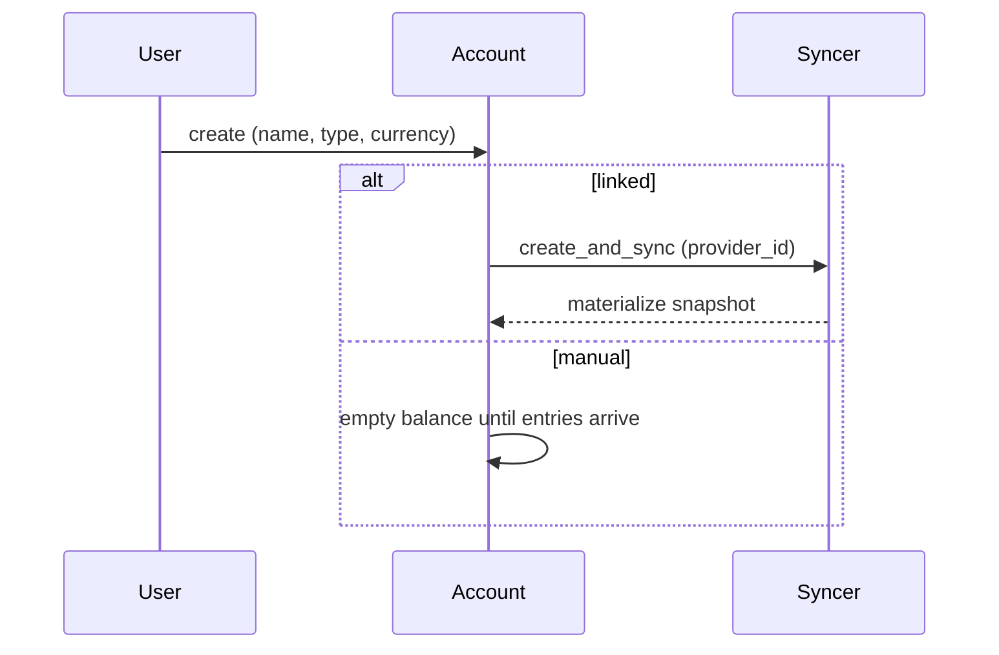

# Accounts

Bank, card, loan, and investment accounts.

## Types and classification

- `checking`, `savings`, `cash`, `credit_card`, `loan`, `investment`, `brokerage`, `mortgage`.
- Balance type: `debit` or `credit` determines the sign convention for balances and entries.
- AASM states: `active`, `archived`.

## Creation and sync

- Manually created accounts can be linked later; linked accounts are materialized from the provider snapshot.
- `create_and_sync` will create then queue a first sync run.

## Current balance

`CurrentBalanceManager` computes balances:

- For bank/cc: ledger last-known balance from sync; fall back to sum of entries
- For loans: principal outstanding
- For investments: market value via holdings \* latest price

## Sparklines

- Daily balances cached per account for the last 90 days
- Used by the dashboard sparklines and account listing
