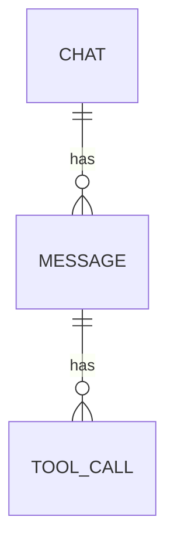
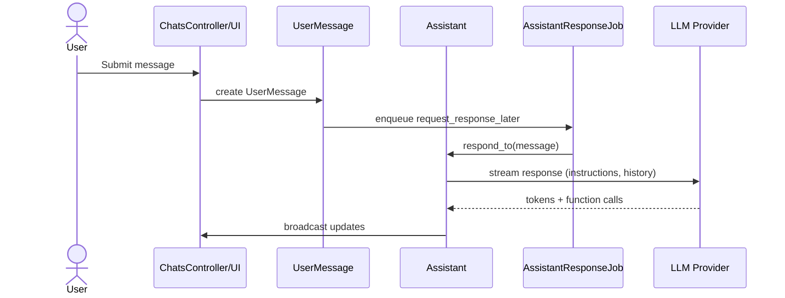

# AI Chat Internals

This document explains how the AI chat feature works.

## Data Model

- Chat has many Messages
- Message types: UserMessage, AssistantMessage; have status and optional tool_calls
- Assistant orchestrates model providers and tool calling
- AssistantResponseJob processes responses asynchronously

## Request Flow

## Providers

- Selection: `Assistant#get_model_provider` favors local Ollama if reachable, else OpenAI (see `docs/local-llm.md`)
- Streaming output handlers append text to an `AssistantMessage`
- Tool calls are serialized on AssistantMessage.tool_calls and executed via FunctionToolCaller

## Tool Calling

- Functions are built for the chat context (e.g., get accounts, budgets)
- Messages with tool calls include the arguments/results in `tool_calls`

## Error Handling

- Errors are captured via `chat.add_error(e)` and broadcast to the UI
- `retry_last_message!` enqueues a retry if the last message is by the user
