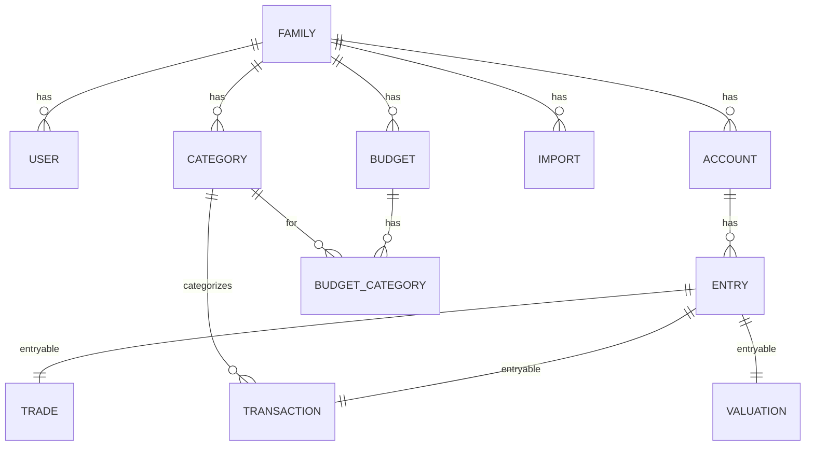
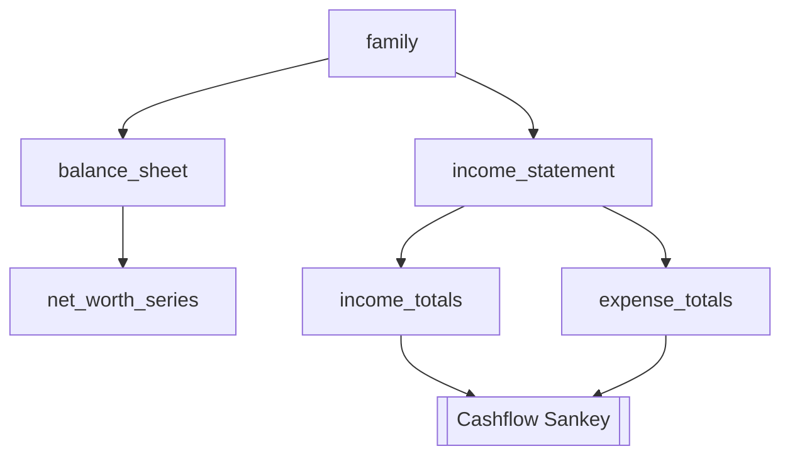

# Architecture

This document summarizes the app architecture and key components discovered in the codebase.

## Backend

- Ruby on Rails monolith
- Models encapsulate business logic (fat models, skinny controllers)
- Hotwire (Turbo/Stimulus) with ViewComponents for UI
- Monetizable concerns wrap Money fields; multi-currency support
- Background jobs with Sidekiq; cron via sidekiq-cron
- OAuth via Doorkeeper; sessions for web auth; optional MFA

## Notable Models and Responsibilities

- Family: tenant scope; owns users, accounts, categories, entries, imports, budgets
- Account: delegated types for kinds; entries ledger; holds balance and holdings
- Entry: ledger row for Transaction/Trade/Valuation; carries amount/date/currency
- Transaction: categorized cash flow; tags, merchants; kinds for transfer semantics
- Category: two-level income/expense taxonomy; colors/icons
- BalanceSheet: aggregates accounts into assets/liabilities; net worth + series
- IncomeStatement: aggregates transactions; totals by category + medians/averages
- Budget: monthly, per family; syncs budget categories; alloc/actual/spend metrics
- BudgetCategory: per-category budget data with helpers for overage/segments
- Import (+ subclasses): CSV import pipeline with mapping and publishing
- Chat/Message/Assistant: AI assistant orchestration and provider abstraction

## UI Composition

- Components in `app/components/DS` implement design system (dialogs, tabs, links)
- Tailwind-based tokens and utility classes
- Turbo + Stimulus for interactions; server-side rendering for data

## Data Flow Diagrams

### Domain overview

### Dashboard data

