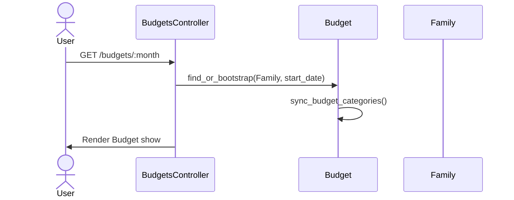

# Budgeting Logic

This document explains how monthly budgets work and how the metrics are computed.

## Lifecycle

- Accessing a budget route `budgets/:month_year` calls `Budget.find_or_bootstrap(family, start_date:)`.
- Bootstrap will find/create the monthly `Budget` for the family, set currency, and `sync_budget_categories`.
- Sync adds/removes `BudgetCategory` rows to match the family's current expense categories.



## Key Fields

- Budget
  - budgeted_spending (Money): total planned monthly spend
  - expected_income (Money): expected monthly income
  - actual_spending (derived): sum of expense totals in period
  - allocated_spending (derived): sum of parent category budgeted amounts
  - available_to_allocate = budgeted_spending - allocated_spending
  - available_to_spend = budgeted_spending - actual_spending
- BudgetCategory
  - budgeted_spending per category
  - actual_spending per category from IncomeStatement totals
  - available_to_spend per category

## Calculations

- Budget#actual_spending: IncomeStatement.expense_totals(period).total
- Budget#budget_category_actual_spending(bc): expense category total for bc.category
- Budget#allocated_spending: sum of budgeted on top-level categories
- Budget#percent_of_budget_spent = actual_spending / budgeted_spending \* 100
- Budget#overage_percent when available_to_spend < 0
- Budget#estimated_income/estimated_spending: medians from IncomeStatement
- Budget#actual_income/actual_income_percent/surplus_percent: period-based

## Donut Segments

- Budget#to_donut_segments_json builds segments by category actuals and includes an "unused" gray segment for remaining budget.
- BudgetCategory#to_donut_segments_json shows category spend and either overage (red) or unused (gray).

```mermaid
flowchart LR
  A[Transactions in period]\n(visible)
  -->|aggregate| E[IncomeStatement.expense_totals]
  E -->|total| B.actual_spending
  E -->|per category| BC.actual_spending
  B.budgeted_spending --> Metrics
  BC.budgeted_spending --> Metrics
```

## Navigation

- `previous_budget_param` and `next_budget_param` compute adjacent months within allowable range (from oldest entry date up to current month).

## Edge Cases

- Empty budgets: donut renders a single gray segment.
- Uninitialized budget (no budgeted_spending): UI hides editor and shows prompt.
- Uncategorized: a virtual BudgetCategory that soaks up remaining available_to_allocate.
