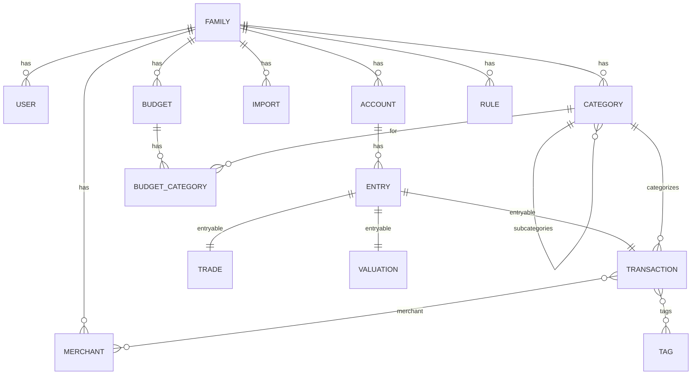

# Domain Model

This page documents the key entities and relationships used across the app.

Notes:

- Entries are the ledger rows that carry amount, date, and currency, and belong to an account. Transactions/Trades/Valuations are entryable types.
- Categories have at most two levels (parent -> subcategory); classification is income or expense.
- Budget categories mirror the family's expense categories for a given month.
