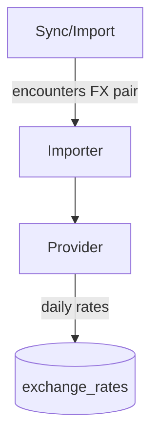

# Exchange Rates

Multi-currency support.

## Provider abstraction

- `ExchangeRate::Provider` interface with implementations (e.g., TwelveData)
- Rates stored per day per currency pair

## Importer

- Nightly job fetches missing days and fills gaps
- Backfills on-demand when encountering a new currency pair

## Money exchange

- `Money.exchange_to` uses latest on/after date with fallback
- Tolerates sparse data; warns when extrapolating > N days
