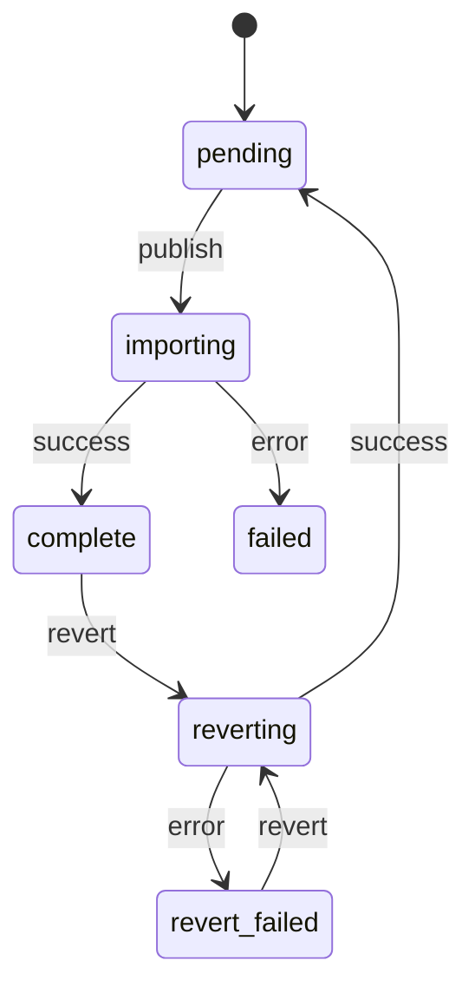
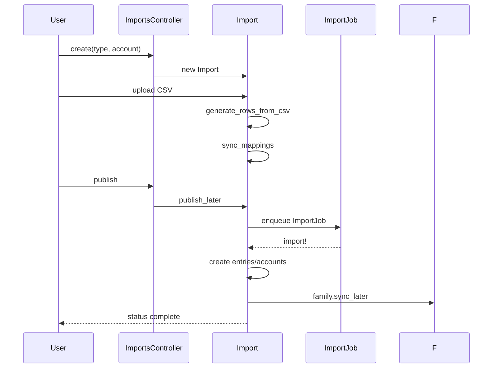

# Imports Pipeline

This page documents the CSV import system and its states.

## Types

Supported import types (see `Import::TYPES`):

- TransactionImport
- TradeImport
- AccountImport
- MintImport

## State Machine

`Import.status` can be: pending -> importing -> complete, or failed. Reverts: complete/revert_failed -> reverting -> pending.

## Workflow

1. Create import (`ImportsController#create`) with type/account
2. Upload CSV -> `Import#raw_file_str`
3. Generate rows from CSV headers via `Import#generate_rows_from_csv`
4. Sync mappings (accounts, categories, tags) via `Import#sync_mappings`
5. Clean: rows validated and normalized
6. Publish: `Import#publish_later` enqueues `ImportJob`
7. On success: entries/accounts created; family sync enqueued; status to complete
8. Revert: enqueues `RevertImportJob` to delete created records and resync

## Number Formats and Sanitization

- `Import::NUMBER_FORMATS` defines common separators/delimiters
- `sanitize_number` normalizes strings to a safe float parseable format

## Limits

- Max rows: 10,000 (configure via `max_row_count`)

## Templates

- `suggested_template` fetches the last successful import of same type/account
- `apply_template!` copies the mapping and parsing configuration
