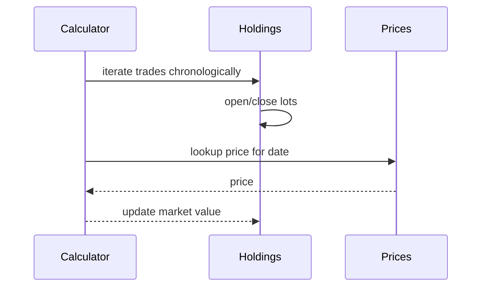

# Investments

Trades, holdings, and valuations.

## Model

- Entry is polymorphic to Trade or Valuation for investment accounts
- Holdings aggregate positions by security and lot method (FIFO by default)
- Prices sourced from provider (e.g., Plaid) or fallback quote APIs

## Calculations

- Forward calculator: apply trades in chronological order to compute lots and cost basis
- Reverse calculator: compute realized gains for a sell by matching prior lots
- Portfolio cache: daily snapshot of market value per account and family

## Reports

- Positions table with quantity, cost basis, market value, unrealized gain
- Realized gains report by period and security
