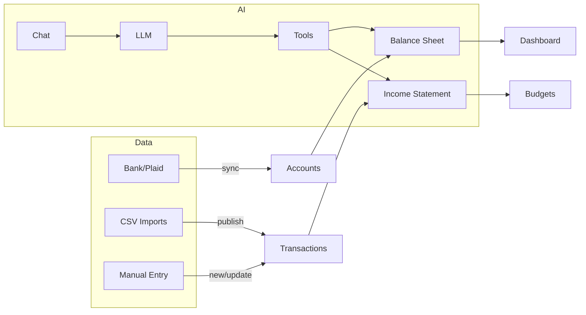

# Product Overview and Features

Sure (~Maybe) is a self-hostable personal finance app. It helps users track accounts, transactions, budgets, holdings, imports, and provides an AI assistant for insights. This page lists core features and how they work at a high level.

## Core Features

- Accounts and balances
  - Manual and Plaid-linked accounts (Depository, Credit Card, Investment, Crypto, Property, Vehicle, Loans, Other assets/liabilities)
  - Balance sheet with net worth and historical series
- Transactions
  - CRUD with search/filtering, tags, merchants, and categorization
  - Transfer matching (funds movement, cc/loan payments excluded from budgets)
- Categories
  - Two-level hierarchy (parent/subcategory) with income/expense classification
  - Color/icon per category; uncategorized is a virtual category
- Budgets
  - Monthly budgets per family; allocates expected income and spending
  - Budget categories synchronized from expense categories
  - Actual vs budget metrics and donut visualizations
- Imports
  - CSV-based pipeline for transactions, trades, accounts (Mint import too)
  - Configurable mapping, validation, dry-run, revert
- AI Assistant
  - Chat with user; streams responses; optional local LLM via Ollama
  - Tool calls to read financial data
- API
  - OAuth2 and API-key auth; Chat API endpoints available
- Settings & Admin
  - Onboarding, preferences, currency, date format, security (MFA), subscriptions
  - Background jobs and Sidekiq dashboards

## High-level Flow

See the dedicated docs for specifics on each subsystem.
