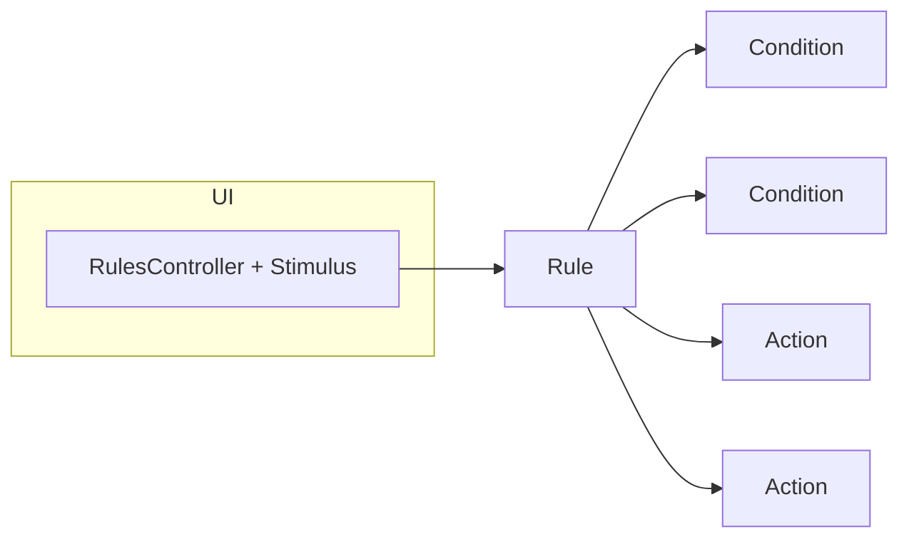
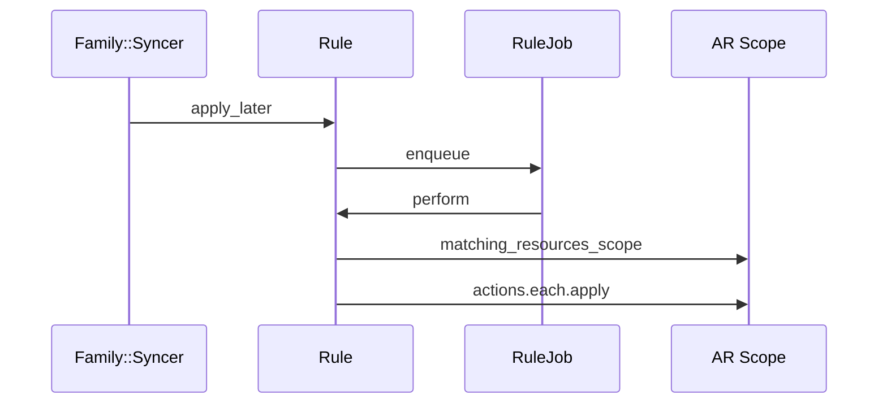

# Rules Engine

Automate transaction enrichment with conditions and actions.

## Overview

A Rule has:

- resource_type: currently `transaction`
- effective_date: only applies to resources on/after this date
- conditions: one or more `Rule::Condition` (including compound `and`/`or` groups)
- actions: one or more `Rule::Action` which are executed on matching resources

## Conditions

- Filters are provided by `Rule::Registry::TransactionResource#condition_filters`:
  - TransactionName (text; operators: contains, equals)
  - TransactionAmount (number; operators: >, >=, <, <=, =; uses absolute value)
  - TransactionMerchant (select; equals; options are family-assigned merchants)
- Compound condition groups support `all/any` of sub-conditions; nesting beyond 1 level is not allowed.

## Actions

- SetTransactionCategory (select)
- SetTransactionTags (select; single tag; can be applied repeatedly)
- SetTransactionMerchant (select)
- AutoCategorize (function; uses AI provider)
- AutoDetectMerchants (function; uses AI provider)

Actions call `executor.execute(scope, value:, ignore_attribute_locks:)` and typically use `Transaction#enrich_attribute` guarded by `enrichable(:attr)` unless `ignore_attribute_locks` is true.

## Apply and scheduling

- Rules run during family sync (`Family::Syncer#perform_sync`), calling `rule.apply_later` for each rule.
- Users can also run a rule manually.

## AI-driven enrichment

- AutoCategorizer and AutoMerchantDetector call the LLM via `Provider::Registry` (OpenAI or Ollama when configured) with:
  - user_categories (id, name, hierarchy, classification)
  - transactions (id, abs(amount), classification, description, merchant)
- Responses are mapped back by transaction id and applied via `enrich_attribute` then `lock_attr!`.

## UX helpers

- When a user categorizes a transaction, the app may show a CTA to create a Rule if no existing rule would have produced that outcome (`Transaction::Ruleable#eligible_for_category_rule?`).
