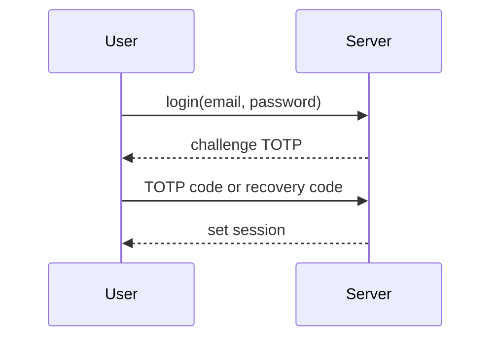

# Security & Auth

Sessions, MFA, and OAuth.

## Sessions

- Email + password with session cookie
- CSRF protection on all non-GET actions
- Remember-me optional cookie

## MFA

- TOTP with QR provisioning
- Recovery codes stored hashed
- Enforcement per-user; bypass for OAuth token flows

## OAuth (API)

- Doorkeeper issues bearer tokens with scopes: `read`, `write`
- Authorization Code + PKCE for first-party apps
- Token revocation and rotation supported
