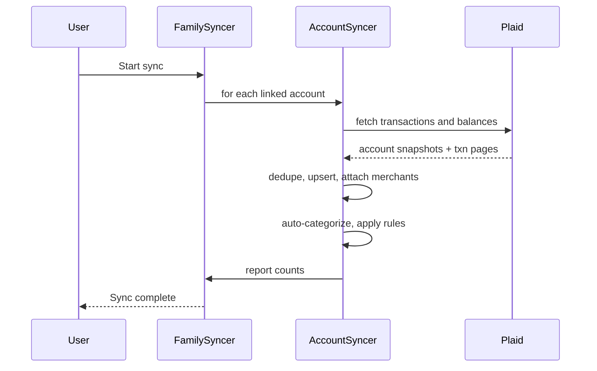

# Sync

Periodic ingestion of transactions, balances, and investment data.

## Entities

- Sync: tracks a run (`pending`, `running`, `failed`, `succeeded`) and duration, error, counts.
- Syncers: service objects that perform work
  - AccountSyncer: pulls transactions/balances for a single account
  - FamilySyncer: orchestrates all accounts in a family
  - PlaidItemSyncer: refreshes access tokens, pulls accounts and transactions, handles webhooks
- Providers
  - Plaid provider implements account discovery, transactions, balances, and investments

## Flow

## Plaid webhooks

- Item webhook: schedules a refresh run for the affected item
- Transactions webhook: schedules a targeted backfill
- Holdings/Investments webhook: refresh positions and prices

## Failure handling

- Retries with exponential backoff for provider errors
- Partial success recorded on the Sync record; follow-up runs continue from cursors
