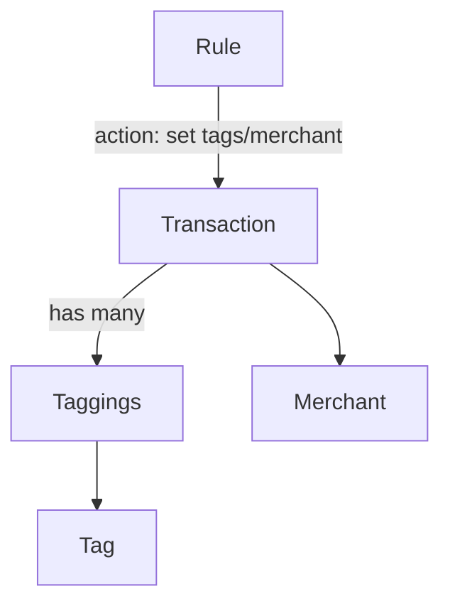

# Tags & Merchants

Lightweight organization and payee management.

## Tags

- Freeform labels attached to transactions via a join table
- CRUD with merge/replace across the family
- Rules can add/remove tags on match

## Merchants

- Normalized payee entity with canonical name and optional website/category hints
- Assignment sources: import mapping, rules, AI merchant detection, manual edit
- Merges supported to consolidate duplicates

## Detection

- On import and during sync, the pipeline extracts a normalized merchant from the raw name (strip numbers, stop-words)
- Optional AI detector suggests a merchant when confidence is low
