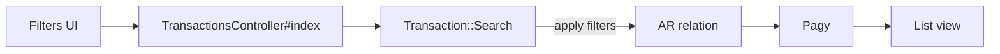
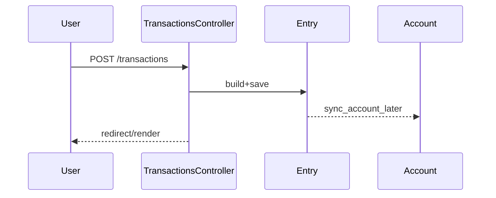

# Transactions

How transactions are created, searched, updated, and enriched.

## Data shape

- Transaction is entryable via `Entry` and belongs to an `Account` (through the entry). Optional relations: `category`, `merchant`, many `tags`.
- Kinds: `standard`, `funds_movement`, `cc_payment`, `loan_payment`, `one_time`. Use `transfer?` to check transfer-like kinds.

## Search and filters (web)

`TransactionsController#index` builds a `Transaction::Search` with filters from `q`:

- Date: `start_date`, `end_date`
- Accounts: `accounts` (names) or `account_ids`
- Categories: `categories` (names)
- Merchants: `merchants` (names)
- Tags: `tags` (names)
- Amount: `amount` with `amount_operator` (>, >=, <, <=, =)
- Types: `types`
- Active accounts only: `active_accounts_only`
- Free text: `search` (matches entry name/notes and merchant name)

`Transaction::Search` applies joins/where clauses efficiently (joins merchants/tags only if needed) and returns a scope suitable for pagination with Pagy.

## Create/update

- New: `TransactionsController#new` prepares income/expense categories for selection.
- Create: `#create` builds `Entry` on selected account; on success it:
  - Schedules `@entry.sync_account_later`
  - Locks saved attributes
- Update: `#update` persists changes and may show a CTA to “Create a rule” when the user categorizes a transaction and the system has no equivalent rule yet.

## Category quick-change

`TransactionCategoriesController#update` updates category in-place and pops a “Create rule” CTA when appropriate. After update, both the transaction and entry saved attributes are locked to prevent re-enrichment.

## Transfer matching

If a transaction looks like a transfer, the UI surfaces match candidates. See transfers doc for details.

## API (brief)

`Api::V1::TransactionsController` exposes index/show/create/update/destroy with Doorkeeper OAuth (`read` and `read_write` scopes). Search and filtering mirror the web flows and include associations for efficiency.
