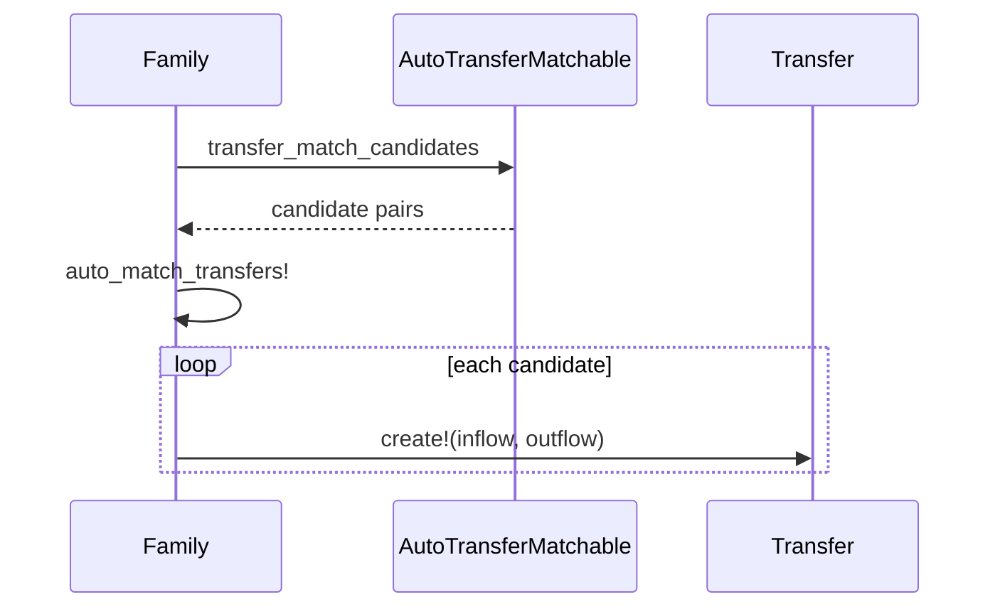

# Transfers

Detecting and managing transfers, CC payments, and loan payments.

## Concepts

- A Transfer links two Transaction records: one inflow (negative entry amount) and one outflow (positive entry amount).
- Validations: different accounts, same family, opposite amounts, within 4 days.
- Status: `pending` or `confirmed`.
- Transaction kinds affected:
  - inflow becomes `funds_movement`
  - outflow becomes `funds_movement`/`cc_payment`/`loan_payment` depending on destination account type

## Auto-matching

`Family::AutoTransferMatchable` computes candidates across accounts:

- Pairs inflow/outflow entries within 4 days, not already matched or rejected, on visible accounts.
- Same-currency: amounts must be exact opposites.
- Multi-currency: uses `exchange_rates` to allow ~5% slippage around the implied conversion.
- Ranks by days apart and deduplicates.

## Manual matching

`TransferMatchesController#new` shows candidates; `#create` supports:

- Existing: link the selected counterpart transaction
- New: create the missing counterpart in a target account

After creation, both transactions are updated with the appropriate kind and the accounts are resynced.

## UI badges

- Pending auto-matches show an “Auto-matched” badge with confirm/reject controls.
- Confirmed transfers show a link icon.
